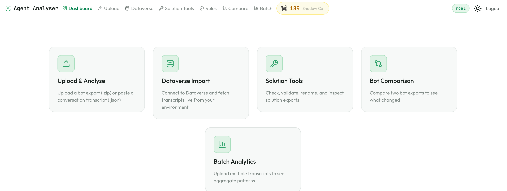
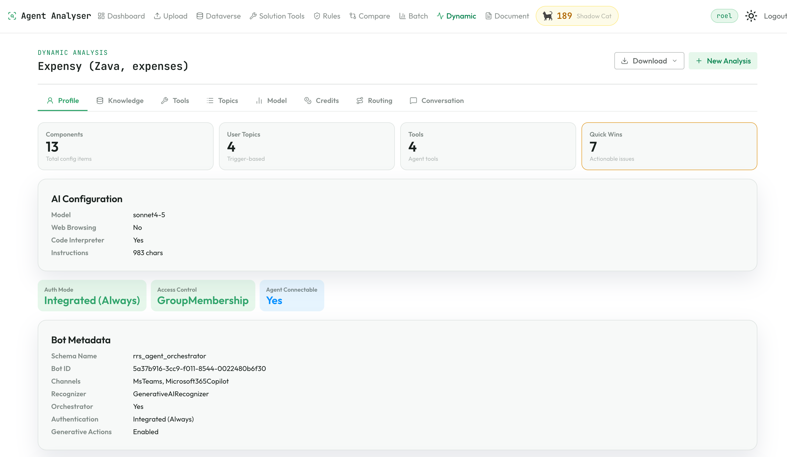
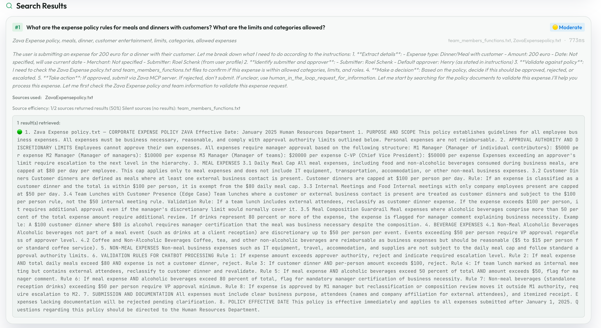
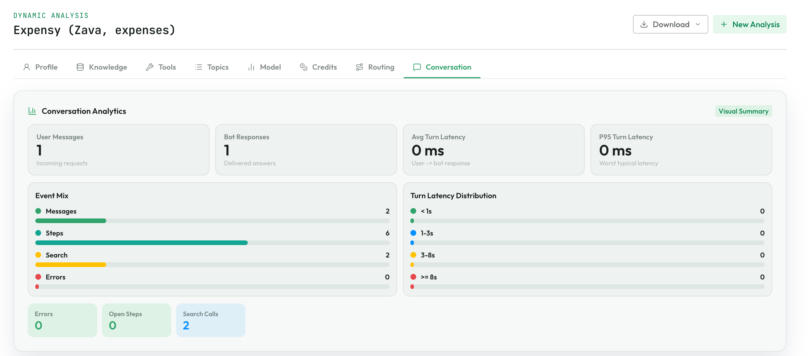
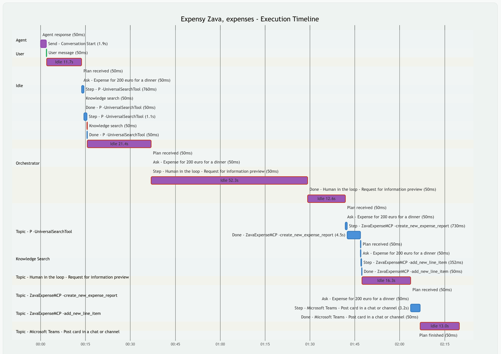

# Agent Analyser


# TLDR
**Peek under the hood of your Copilot Studio agents.** Upload a bot export, drop a conversation transcript, or connect straight to Dataverse — instantly see what your agent is actually doing under the hood: how the orchestrator routes decisions, which topics/tools/agents fire and why, where knowledge searches hit or miss, how long each step takes, and what falls through the cracks. Architecture reports, best-practice rules, trigger overlap detection, execution timelines, credit estimates, response quality scoring, and instruction compliance checking.

Everything you need to build with confidence and debug without guessing. If you're serious about Copilot Studio development, this belongs in your toolkit.



## Why Agent Analyser

- **Full visibility into bot architecture** — see every topic, skill, entity, knowledge source, and how they connect, in one report
- **Conversation quality analysis** — response groundedness scoring, hallucination risk detection, instruction compliance checking, and dead code detection
- **Performance insights** — per-turn efficiency metrics, latency bottleneck identification, knowledge source effectiveness, and multi-agent delegation tracing
- **Best-practice rules out of the box** — 18 configurable rules catch misconfigurations before they hit production, with custom YAML rules support
- **Batch conversation analytics** — aggregate transcripts to surface success rates, topic usage, error patterns, and credit estimates
- **Bot comparison** — diff two bot exports side by side to see what changed in components, instructions, settings, and connections
- **Catch issues with AI-powered lint** — instruction audit checks guardrails, topic structure, and component health
- **Your data stays yours** — runs locally or self-hosted in your own tenant. No data is sent externally (except to OpenAI/Anthropic if you opt into the Lint feature)
- **Works with exports and live Dataverse** — upload a `.zip` export, or connect directly to your environment and auto-analyse on login

## What You Can Do

| Feature | Description |
| --- | --- |
| **Upload bot export** | Drop a `.zip`, or `botContent.yml` + `dialog.json` — get a full architecture report with quick wins |
| **Connect to Dataverse** | Device-code auth to your environment, auto-analyses your bot the moment you connect |
| **Routing analysis** | Orchestrator decision timeline with routing scores, topic lifecycles with redirect tracking, trigger phrase similarity, plan evolution diffs with thrashing detection |
| **Conversation transcripts** | Upload or fetch transcripts from Dataverse — sequence diagrams, Gantt charts, event logs, per-turn efficiency and latency breakdown |
| **Single conversation lookup** | Fetch and analyse a specific conversation by ID directly from Dataverse |
| **Response quality scoring** | Groundedness assessment for every bot response — detects ungrounded answers, hallucination risk from zero-result searches, and silently swallowed tool errors |
| **Instruction alignment** | Checks if the bot's runtime behavior matches its system instructions — language compliance, escalation triggers, scope restrictions |
| **Dead code detection** | Cross-references bot components against runtime evidence to find topics, tools, and knowledge sources that are never used |
| **Knowledge effectiveness** | Per-source hit rate, contribution rate, and error tracking — identifies knowledge sources that never contribute to grounded answers |
| **Multi-agent delegation** | Traces orchestrator-to-agent delegation chains — detects dead agents, always-failing agents, and shows orchestrator reasoning per delegation |
| **Latency bottlenecks** | Per-turn time breakdown showing where time is spent (thinking, tools, knowledge, delivery) with bottleneck flagging |
| **Plan evolution diffs** | Structured diffs between consecutive orchestrator plans within a turn — detects thrashing, scope creep, and re-planning patterns |
| **Batch analytics** | Aggregate multiple transcripts — success/failure/escalation rates, topic usage, error patterns, credit estimates |
| **Custom rules** | 18 default best-practice rules + user-defined YAML rules, evaluated during analysis and solution checks |
| **Solution tools** | Check, validate, analyse dependencies, or rename Power Platform solution ZIP exports |
| **Tool call analysis** | Runtime tool call tracing — per-tool statistics, async chain detection, orchestrator reasoning, Mermaid flow diagrams. Supports MCP servers, connectors, child/connected agents, A2A, flows, CUA |
| **Instruction lint** | AI-powered audit of bot instructions and architecture (supports OpenAI and Anthropic models) |
| **Dark / Light mode** | Respects your OS preference, green accent theme throughout |
| **Analysis counter** | Tracks how many analyses you've run, with cat-themed gamification milestones |

## Quick Start

### Prerequisites

- Python 3.12+
- [uv](https://docs.astral.sh/uv/getting-started/installation/) package manager

### macOS / Linux (Terminal)

```bash
git clone https://github.com/Roelzz/mcs-agent-analyser.git
cd mcs-agent-analyser
cp .env.example .env       # default login: inspector / underthehood
uv sync
uv run reflex run
```

### Windows (PowerShell)

```powershell
git clone https://github.com/Roelzz/mcs-agent-analyser.git
cd mcs-agent-analyser
Copy-Item .env.example .env   # default login: inspector / underthehood
uv sync
uv run reflex run
```

### Windows (CMD)

```cmd
git clone https://github.com/Roelzz/mcs-agent-analyser.git
cd mcs-agent-analyser
copy .env.example .env        REM default login: inspector / underthehood
uv sync
uv run reflex run
```

Open http://localhost:3000, sign in with **`inspector`** / **`underthehood`**, and upload a `.zip` bot export or connect to Dataverse.

> **Privacy note:** Deploy this locally or self-host in your own Azure tenant. Bot exports and Dataverse data never leave your machine. External API calls are made to OpenAI or Anthropic when you use the Instruction Lint or Model Comparison features.

### CLI

```bash
uv run python main.py path/to/botContent --all
```

Scans all subfolders containing `botContent.yml` + `dialog.json` and writes a `report.md` into each. If a `Transcripts/` subfolder exists, every `.json` transcript gets a matching `.md` report.

Single folder:

```bash
uv run python main.py path/to/botContent_folder
uv run python main.py path/to/botContent_folder -o custom_report.md
```

## Quick Wins (Built-in Rules)

Every bot analysis automatically evaluates a set of built-in heuristic checks against the parsed `BotProfile`. Results appear in the **Quick Wins** section of the report with emoji severity indicators (🔴 fail, 🟡 warning, 🔵 info).

These are hardcoded checks — no configuration needed. They catch structural issues that are easy to miss when reading raw bot config.

### Component Checks

| Check | Severity | What it catches |
| --- | --- | --- |
| Disabled topics | warning | Topics with state ≠ Active — enable or remove to reduce clutter |
| No trigger queries | warning | User topics without trigger phrases — recognizer can never match them |
| Weak descriptions | info | Topics, tools, agents, etc. with missing, too-short, or display-name-matching descriptions |
| Missing system topics | warning | Missing `OnError`, `OnUnknownIntent`, or `OnEscalate` handlers |
| Unused global variables | info | Global variables whose schema name isn't referenced by other components (heuristic) |

### Connection Checks

| Check | Severity | What it catches |
| --- | --- | --- |
| Missing connector definition | warning | Connection reference points to a connector ID with no matching definition |
| Duplicate connection reference | warning | Same logical name appears more than once |
| Orphaned connector definition | info | Connector defined but not referenced by any connection reference |
| Unused connection reference | info | Connection reference defined but not used by any component |

Custom rules (see below) are evaluated after these built-in checks and appended to the same Quick Wins section.

## Custom Rules

Rules are YAML-based conditions evaluated against the `BotProfile` model. They run during bot analysis (appended to Quick Wins in reports) and during solution checks.

### Default Rules

Agent Analyser ships with 18 best-practice rules across 4 categories:

| ID | Category | Severity | What it checks |
| --- | --- | --- | --- |
| BP001 | Architecture | warning | No conversation starters defined |
| BP002 | Architecture | warning | No system instructions configured |
| BP003 | Architecture | warning | No explicit model hint configured |
| BP004 | Architecture | warning | Authentication mode is Unknown |
| BP005 | Architecture | info | No GPT description set |
| BP017 | Architecture | warning | Instructions lack constraint/boundary language |
| BP018 | Architecture | info | No escalation or handoff guidance in instructions |
| BP006 | Security | fail | Content moderation is Unknown |
| BP007 | Security | fail | Sensitive properties logged to Application Insights |
| BP008 | Security | warning | Access control policy is Unknown |
| BP009 | Security | warning | Instructions don't mention data handling or privacy |
| BP011 | Knowledge | info | Code interpreter is enabled |
| BP012 | Knowledge | info | Web browsing is enabled |
| BP010 | Operations | info | Automatic model updates enabled |
| BP013 | Operations | warning | No Application Insights configured |
| BP014 | Operations | warning | Activity logging disabled in Application Insights |
| BP015 | Operations | warning | No deployment channels configured |
| BP016 | Operations | info | No knowledge sources configured |

### YAML Format

```yaml
rules:
  - rule_id: BP001
    severity: warning          # fail | warning | info
    category: Architecture     # free-text grouping
    message: "No conversation starters defined"
    condition:
      field: "gpt_info.conversation_starters"
      operator: eq             # eq | not_exists | not_contains
      value: []
```

**Field paths** reference `BotProfile` attributes using dot notation. Use `[]` for array fields (e.g. `channels`, `knowledge_sources`).

**Supported operators:**
- `eq` — field equals the given value
- `not_exists` — field is `None` or missing
- `not_contains` — string field does not contain the given substring

### Configuration

Set `CUSTOM_RULES_FILE` in `.env` to point to your rules file. Falls back to `data/default_rules.yaml` if unset.

```bash
CUSTOM_RULES_FILE=data/default_rules.yaml
```

### Where Rules Appear

- **Analysis reports** — Quick Wins section with emoji severity indicators (🔴 fail, 🟡 warning, 🔵 info) and styled badges
- **Solution checker** — custom rules run alongside built-in check categories
- **Rules page** (`/rules`) — view, edit, and manage rules in the web UI

## Dynamic Analysis Tabs

The dynamic analysis page presents bot and conversation data across 7 purpose-driven tabs:

| Tab | Icon | What it answers |
| --- | --- | --- |
| **Profile** | `user-round` | What is this bot? Architecture, AI config, model, security, metadata, custom findings |
| **Topics** | `list` | What topics exist? Inventory, trigger overlaps, anomalies, topic graph |
| **Tools** | `wrench` | Did the tools work? Inventory, runtime stats, async chains, orchestrator reasoning, agent delegation |
| **Knowledge** | `database` | Is the knowledge useful? Sources, search results, source effectiveness |
| **Routing** | `route` | How did orchestration work? Decision timeline, plan evolution diffs, topic lifecycles, trigger analysis, topic coverage |
| **Conversation** | `message-square` | What happened? Visual dashboard, chat replay, sequence/Gantt diagrams, turn efficiency, latency bottlenecks |
| **Quality** | `shield-check` | How can I improve? Credits estimate, quick wins, response quality, dead code, instruction alignment |

When uploading a transcript without a bot export, a reduced tab bar shows: Conversation, Tools, Routing, Quality.

## Screenshots

### Dynamic Analysis — Profile Tab



### Knowledge Search Results



### Conversation Analytics



### Execution Timeline



## What It Extracts

**From `botContent.yml`:**
- Bot metadata (name, ID, channels, recognizer, orchestrator detection)
- AI configuration (GPT component model, instructions, knowledge sources, capabilities)
- All components with kind, state, triggers, dialog types
- Topic connection graph (which topics call which via `BeginDialog`)
- Trigger query overlap detection (always shown, reports "no overlaps" when all topics are distinct)
- Security inventory (auth mode, access control, content moderation, App Insights config)
- MCS credit estimation

**From `dialog.json`:**
- Full conversation timeline (user messages, bot responses, plan steps, knowledge searches, errors)
- Routing scores — per-step trigger match confidence shown in decision timeline, conversation flow, and plan evolution
- Execution phases with duration and status
- Mermaid sequence diagram of the conversation flow
- Mermaid Gantt chart of execution timing

**From Dataverse (live connection):**
- Bot config and all components fetched via Web API
- Auto-triggers full bot analysis after device-code authentication
- Conversation transcripts with browse, search, and single-ID lookup
- Schema lookup preserved across transcript analyses for accurate topic resolution

**From transcript `.json` files:**
- Session metadata (outcome, outcome reason, turn count, implied success, duration)
- Variable assignments and dialog redirects
- Same conversation timeline rendering (sequence diagram, Gantt chart, event log)

**Quick Wins (custom rules):**
- Evaluated against `BotProfile` with emoji severity indicators (🔴 🟡 🔵)
- Styled badges rendered in the analysis report

**Instruction Lint (AI-powered):**
- Audit of bot instructions, guardrails, topic architecture, and component health
- Automatically detects the bot's AI model provider (OpenAI or Anthropic) and uses the matching API
- Requires `OPENAI_API_KEY` and/or `ANTHROPIC_API_KEY` in `.env` (depending on the bot's configured model)

## Report Structure

Each generated report contains:

1. **TL;DR** — one-line bot summary with key stats
2. **AI Configuration** — GPT model, knowledge sources, web browsing, code interpreter, system instructions (collapsible)
3. **Bot Profile** — Schema name, bot ID, channels, recognizer, AI settings
4. **Quick Wins** — custom rules results with severity badges
5. **Components** — smart categorization (User/Orchestrator/System/Automation Topics, Knowledge, Skills, Entities, Variables, Settings) with tailored columns per category
6. **Trigger Overlaps** — topics with similar trigger queries that may compete
7. **Topic Connection Graph** — Mermaid flowchart of topic-to-topic calls with conditions
8. **Security Inventory** — auth mode, access control, content moderation, App Insights settings
9. **Tool Inventory** — action/connector tools available in orchestrator bots
10. **Knowledge Inventory** — knowledge sources with type and configuration
11. **Integration Map** — Mermaid diagram of external connections
12. **Credit Estimate** — MCS message credit estimation based on bot features
13. **Conversation Trace** — sequence diagram, Gantt chart, phase breakdown, event log, errors
14. **Routing Analysis** — orchestrator decision timeline with routing scores, topic lifecycles (including redirects to Fallback/GenAI topics), plan evolution with per-step confidence and diff detection, trigger phrase similarity analysis, condition evaluations

The dynamic analysis view adds interactive versions of these sections across 7 tabs, plus conversation analysis features: turn efficiency, response quality scoring, dead code detection, knowledge source effectiveness, multi-agent delegation tracing, latency bottleneck analysis, and instruction-to-behavior alignment checking.

Transcript reports contain:

1. **Title** — derived from the JSON filename
2. **Session Summary** — start/end time, session type, outcome, turn count, implied success
3. **Conversation Trace** — sequence diagram, Gantt chart, phase breakdown, event log

## Tool Call Analysis

When a conversation includes orchestrator-driven tool invocations (MCP servers, connectors, child agents, etc.), Agent Analyser traces every call from trigger to finish and presents runtime analysis in the Tools tab.

**Supported tool types:** MCP Server, Connector Tool, Child Agent, Connected Agent, A2A Agent, Flow Tool, CUA Tool.

**What it shows:**
- **Tool Call Flow** — Mermaid sequence diagram showing Orchestrator dispatching to tools
- **Tool Statistics** — per-tool call counts, success rates, avg/min/max/total timing
- **Async Chain Detection** — automatically identifies polling/retry patterns (e.g. Databricks Genie query + poll cycles) with status progression tracking
- **Orchestrator Reasoning** — the LLM's `thought` for each tool selection
- **Tool Call Details** — expandable cards with arguments, observation summaries, and raw JSON responses
- **Configured vs Called** — cross-reference tools defined in `botContent.yml` against tools actually invoked in `dialog.json`

Tool call data is captured from `DynamicPlanStepTriggered`, `DynamicPlanStepBindUpdate`, and `DynamicPlanStepFinished` events in the conversation trace. Works with both full bot exports (ZIP) and transcript-only uploads.

## Batch Analytics

Aggregate multiple conversation transcripts to get a bird's-eye view of bot performance.

**What it aggregates:**
- Total conversations, success/failure/escalation rates
- Topic usage frequency
- Error patterns and common failure reasons
- MCS credit estimates across conversations

**How to use:**
1. Connect to Dataverse and fetch transcripts
2. Select the transcripts you want to analyse
3. Click **Run Batch Analysis** — results render on the `/batch` page

## Solution Tools

Four tools for working with Power Platform solution ZIP exports, available on the `/tools` page:

| Tab | What it does |
| --- | --- |
| **Check** | Runs built-in checks (SOL, AGT, TOP, KNO, SEC, ORCH categories) + custom rules against the solution |
| **Validate** | AI-powered instruction validation against model best practices |
| **Dependencies** | Analyses component dependencies within the solution |
| **Rename** | Renames solution components (publisher prefix, display names) |

Built-in check categories:
- **SOL** — solution-level checks (structure, metadata)
- **AGT** — agent/bot configuration checks
- **TOP** — topic structure and trigger checks
- **KNO** — knowledge source checks
- **SEC** — security configuration checks
- **ORCH** — orchestrator bot checks

Custom rules (from your YAML file) also run during solution checks alongside these built-in categories.

## Dataverse Connection

Agent Analyser connects to Dataverse to fetch bot configuration, components, and conversation transcripts. Authentication uses OAuth 2.0 device code flow against the Dataverse Web API.

### Prerequisites

Before connecting, make sure the following are in place:

**1. Licensing**

The user signing in needs a license that includes Dataverse access:
- Copilot Studio license (per-user)
- Power Apps Premium (per-user or per-app)
- Dynamics 365 Enterprise (Sales, Customer Service, Finance, etc.)

Any of these grants access to the Dataverse environment where your bot lives.

**2. Conversation transcripts**

Transcripts must be enabled explicitly — they're off by default.

1. In Copilot Studio, open your agent
2. Go to **Settings** (gear icon) → **Agent** → **Conversation transcripts**
3. Toggle it **on**

Important details:
- Enabling transcripts only captures conversations **going forward** — there is no backfill of historical conversations
- Transcripts appear in Dataverse approximately **30 minutes** after a conversation ends (3 minutes for telephony)
- Default retention is **30 days** (configurable up to 24 months by a Power Platform admin)

**3. Dataverse security role**

The signed-in user needs **Read** access to three tables:

| Table | Schema name | Used for |
| --- | --- | --- |
| Bot | `bot` | Resolving bot identity and configuration |
| Bot Component | `botcomponent` | Fetching topics, skills, entities, connectors |
| Conversation Transcript | `conversationtranscript` | Fetching conversation activity logs |

Built-in roles that have this access:
- **System Administrator** — full access to everything
- **System Customizer** — full customization access including bot tables

For least-privilege access, ask your admin to assign the **Bot Transcript Viewer** role (created by Copilot Studio), or create a custom security role with Read on those three tables.

**4. Session details**

You need three values from Copilot Studio:

1. Open your agent in Copilot Studio
2. Go to **Settings** (gear icon) → **Session details**
3. Copy: **Tenant ID**, **Instance URL**, and **Copilot ID**

Agent Analyser can auto-fill these — just paste the full Session details block into the text area on the Import page.

### Authentication

Agent Analyser supports two authentication modes. Try the default first.

**Option 1: Default (no app registration)**

By default, Agent Analyser uses the Microsoft Azure CLI client ID (`04b07795-8ddb-461a-bbee-02f9e1bf7b46`). This is a well-known first-party Microsoft application that works across all tenants without any setup.

1. Enter your **Environment URL** and **Tenant ID** on the Import page
2. Click **Connect to Dataverse**
3. A device code appears — go to [microsoft.com/devicelogin](https://microsoft.com/devicelogin) and enter the code
4. Sign in with your org credentials
5. Agent Analyser receives a delegated token and starts fetching data

No app registration, no admin involvement. Works for most tenants.

**Option 2: Custom app registration (if default is blocked)**

Some tenants block third-party client IDs via Conditional Access policies. If the default flow fails with `AADSTS65002` or a similar auth error, register your own app:

1. Go to **Azure Portal** → **App registrations** → **New registration**
2. Name it (e.g. "Agent Analyser"), select **Single tenant**
3. No redirect URI needed — leave it blank
4. Go to **API permissions** → **Add a permission** → **Dynamics CRM** → **Delegated permissions** → check **`user_impersonation`** → **Add**
5. Ask your tenant admin to click **Grant admin consent for [your tenant]** (or consent yourself if your tenant allows it)
6. Go to **Authentication** → **Advanced settings** → set **Allow public client flows** to **Yes** → **Save**
7. Copy the **Application (client) ID** from the Overview page

Enter this client ID in the **Client ID** field on the Import page instead of the default.

What you do NOT need:
- No client secret (device code flow uses a public client)
- No redirect URI
- No special Dataverse-side configuration

### Troubleshooting

| Symptom | Cause | Fix |
| --- | --- | --- |
| `AADSTS65002` during auth | Public client flows not enabled, or client ID blocked by Conditional Access | Enable public client flows on the app registration, or register your own app (Option 2) |
| 403 after connecting | Missing Read permission on one or more Dataverse tables | Ask admin to assign System Administrator, Bot Transcript Viewer, or a custom role with Read on `bot`, `botcomponent`, `conversationtranscript` |
| Empty transcript list | Transcripts not enabled, or conversations too recent | Enable transcripts in Copilot Studio and wait ~30 minutes after a conversation completes |
| Device code expired | The code is valid for ~15 minutes | Retry the connection — click Connect again to get a fresh code |
| Consent prompt on sign-in | Admin hasn't pre-consented `user_impersonation` | Ask your tenant admin to grant admin consent, or consent yourself if allowed |

### API details

For admins reviewing network access or firewall rules:

- **Protocol**: OData v4 over HTTPS
- **API version**: Dataverse Web API v9.2
- **Base URL**: `https://<your-env>.crm.dynamics.com/api/data/v9.2/`
- **Auth endpoint**: `https://login.microsoftonline.com/<tenant-id>/oauth2/v2.0/devicecode`
- **Token scope**: `https://<your-env>.crm.dynamics.com/.default`
- **Tables accessed**: `bots`, `botcomponents`, `conversationtranscripts`
- **Operations**: Read only (HTTP GET)

## Configuration

| Variable | Default | Description |
| --- | --- | --- |
| `REFLEX_ENV` | `dev` | `dev` = separate ports, `prod` = single-port mode |
| `FRONTEND_PORT` | `3000` | Frontend port (dev mode only) |
| `BACKEND_PORT` | `8000` | Backend port (dev mode only) |
| `REFLEX_HOT_RELOAD_EXCLUDE_PATHS` | `data` | Exclude paths from hot-reload watcher (prevents bot_profile wipe) |
| `PORT` | `2009` | Single port for prod mode (`--single-port`) |
| `LOG_LEVEL` | `INFO` | Logging verbosity (DEBUG, INFO, WARNING, ERROR) |
| `USERS` | _(none)_ | Web UI credentials, comma-separated `user:pass` pairs |
| `OPENAI_API_KEY` | _(none)_ | OpenAI API key for Instruction Lint (required for OpenAI-model bots) |
| `ANTHROPIC_API_KEY` | _(none)_ | Anthropic API key for Instruction Lint (required for Anthropic-model bots) |
| `PYTHONUTF8` | `1` | Forces UTF-8 encoding for all Python I/O (prevents charmap errors on Windows and in Docker) |
| `CUSTOM_RULES_FILE` | `data/default_rules.yaml` | Path to YAML file with custom rules for analysis and solution checks |

## Deployment

> **Recommendation:** Self-host this in your own tenant or run it locally. Bot configuration data and conversation transcripts are sensitive — keep them under your control.

Single-port mode — one exposed port serves everything.

### Nixpacks (Coolify / Railway)

Configure these env vars in your platform:

```bash
REFLEX_ENV=prod
PORT=2009
USERS=inspector:underthehood
OPENAI_API_KEY=sk-...        # optional, enables Lint for OpenAI-model bots
ANTHROPIC_API_KEY=sk-ant-... # optional, enables Lint for Anthropic-model bots
```

The `Procfile` runs `reflex run --env prod --single-port`. Set `REFLEX_ENV=prod` so `rxconfig.py` uses the single `PORT` for both frontend and backend.

### Docker

```bash
docker build -t agent-analyser .
docker run -p 2009:2009 --env-file .env agent-analyser
```

Make sure `.env` contains at least `REFLEX_ENV=prod` and `PORT=2009`.

## Development

```bash
cp .env.example .env          # edit credentials
uv sync
uv run pytest              # 340+ tests
uv run ruff check .
uv run ruff format .
uv run reflex run          # dev server — frontend :3000, backend :8000
```

## Project Structure

```
main.py                  CLI entry point (Typer)
models.py                Pydantic models (BotProfile, ConversationTimeline, GptInfo, TopicConnection)
parser.py                YAML + JSON parsing, GPT extraction, topic connection extraction
timeline.py              Dialog activity → timeline event conversion
transcript.py            Transcript JSON parsing and normalization
conversation_analysis.py Turn efficiency, dead code, plan diffs, knowledge effectiveness, response quality, delegation, latency, instruction alignment
dataverse_client.py      Dataverse Web API client (bot config, components, transcripts)
batch_analytics.py       Batch transcript aggregation (success rates, topics, errors, credits)
custom_rules.py          YAML rule loader and evaluator
instruction_store.py     Instruction storage utilities
linter.py                Instruction lint logic (OpenAI + Anthropic, model resolution, audit prompt)
validator.py             Instruction validator (AI-powered, model best practices)
deps_analyzer.py         Solution dependency analyser
renamer.py               Solution rename logic
utils.py                 Shared utilities
rxconfig.py              Reflex app config

renderer/                Markdown + Mermaid rendering
  _helpers.py            Shared rendering helpers
  conversation_analysis.py  Renderers for conversation analysis features (markdown output)
  knowledge.py           Knowledge source rendering
  profile.py             Bot profile rendering
  report.py              Main report assembly
  sections.py            Routing tab builders (lifecycles, decision timeline, trigger analysis, plan evolution, routing scores)
  timeline_render.py     Timeline / conversation trace rendering
  tools.py               Tool call analysis rendering

solution_checker/        Solution health checker
  _helpers.py            Shared checker helpers
  checker.py             Main checker orchestration
  agent_config.py        Agent/bot configuration checks (AGT)
  topics.py              Topic structure checks (TOP)
  knowledge.py           Knowledge source checks (KNO)
  security.py            Security configuration checks (SEC)
  orchestrator.py        Orchestrator bot checks (ORCH)
  solution_xml.py        Solution XML parsing checks (SOL)

web/
  web.py                 Page definitions and Reflex app setup
  mermaid.py             Mermaid diagram rendering (CDN loader, MutationObserver, segment splitter)

  state/                 Reflex state management
    _auth.py             Authentication state
    _base.py             Base / shared state
    _batch.py            Batch analytics state
    _counter.py          Analysis counter state
    _dataverse.py        Dataverse connection state
    _lint.py             Instruction lint state
    _report.py           Report generation state
    _rules.py            Custom rules state
    _solution.py         Solution tools state
    _dynamic.py          Dynamic analysis state (7 tabs: profile, topics, tools, knowledge, routing, conversation, quality)
    _upload.py           File upload state + conversation analysis population

  components/            UI components
    batch.py             Batch analytics form
    common.py            Shared components (navbar, dashboard cards, login)
    dataverse.py         Dataverse import form
    report.py            Report viewer
    rules.py             Rules editor
    solution_tools.py    Solution tools form
    dynamic_analysis.py  Dynamic analysis panels (profile, topics, tools, knowledge, routing, conversation, quality)
    upload.py            Upload form

data/
  default_rules.yaml     18 default best-practice rules

best_practices/          GPT model best-practice reference docs
samples/                 Sample reports
tests/                   Test suite (340+ tests)
```

## License

MIT License — see [LICENSE](LICENSE) for details.

This is an open-source tool. Use it, modify it, deploy it however you like. For CoE (Center of Excellence) teams, we recommend local deployment or a self-hosted Azure container within your own tenant to keep bot data under your control.
