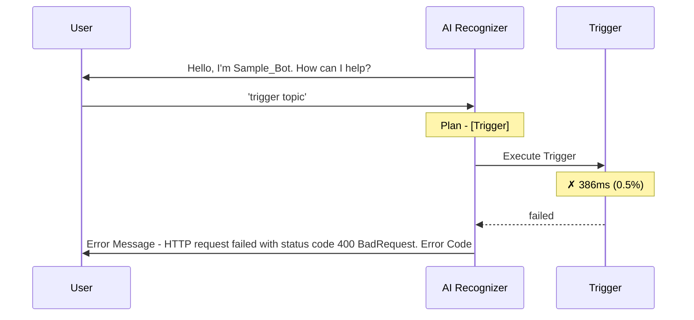
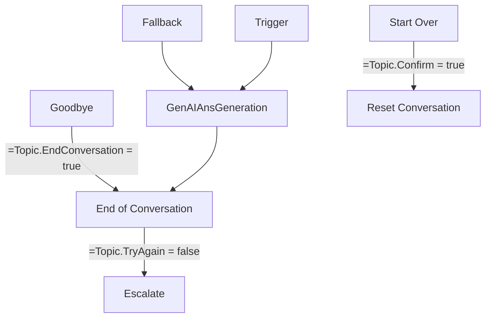

# Sample_Bot

## AI Configuration

| Property | Value |
| --- | --- |
| Knowledge Sources | SearchAllKnowledgeSources |
| Web Browsing | False |
| Code Interpreter | False |

### Execution Flow

### Execution Gantt

```mermaid
gantt
    dateFormat x
    axisFormat %M:%S
    title Sample_Bot — Execution Timeline
    section Bot
    Bot response (50ms) :e0, 1770109608689, 1770109608739
    section System
    Dialog trace (1m 22.7s) :e1, 1770109608689, 1770109691385
    section User
    User message (1.1s) :e2, 1770109691385, 1770109692444
    section Orchestrator
    Plan received (50ms) :e3, 1770109692444, 1770109692494
    Ask - 'trigger topic' (50ms) :e4, 1770109692444, 1770109692494
    section Trigger
    Step - Trigger (50ms) :e5, 1770109692446, 1770109692496
    section System
    Dialog trace (356ms) :e6, 1770109692474, 1770109692830
    Dialog trace (50ms) :e7, 1770109692830, 1770109692880
    section Trigger
    Done - Trigger (50ms) :crit, e8, 1770109692832, 1770109692882
    section System
    Dialog trace (50ms) :e9, 1770109692835, 1770109692885
    section Bot
    Bot response (50ms) :e10, 1770109692840, 1770109692890
    section System
    Dialog trace (50ms) :e11, 1770109692840, 1770109692890
```

## Bot Profile

| Property | Value |
| --- | --- |
| Schema Name | `sample_bot_12345` |
| Bot ID | `00000000-0000-0000-0000-000000000000` |
| Channels | MsTeams |
| Recognizer | GenerativeAIRecognizer |
| Orchestrator | No |
| Use Model Knowledge | False |
| File Analysis | True |
| Semantic Search | True |
| Content Moderation | Medium |

## Components

**16** components total — **15** active, **1** inactive

| Kind | Count | Active | Inactive |
| --- | --- | --- | --- |
| DialogComponent | 15 | 14 | 1 |
| GptComponent | 1 | 1 | 0 |

### DialogComponent (15)

| Name | Schema | State | Trigger | Dialog Kind |
| --- | --- | --- | --- | --- |
| Reset Conversation | `sample_bot_12345.topic.ResetConversation` | Active | OnSystemRedirect | — |
| Sign in  | `sample_bot_12345.topic.Signin` | Active | OnSignIn | — |
| Fallback | `sample_bot_12345.topic.Fallback` | Active | OnUnknownIntent | — |
| Goodbye | `sample_bot_12345.topic.Goodbye` | Active | OnRecognizedIntent | — |
| On Error | `sample_bot_12345.topic.OnError` | Active | OnError | — |
| Greeting | `sample_bot_12345.topic.Greeting` | Active | OnRecognizedIntent | — |
| Thank you | `sample_bot_12345.topic.ThankYou` | Active | OnRecognizedIntent | — |
| Escalate | `sample_bot_12345.topic.Escalate` | Active | OnEscalate | — |
| GenAIAnsGeneration | `sample_bot_12345.topic.GenAIAnsGeneration` | Active | OnRedirect | — |
| Multiple Topics Matched | `sample_bot_12345.topic.MultipleTopicsMatched` | Active | OnSelectIntent | — |
| End of Conversation | `sample_bot_12345.topic.EndofConversation` | Active | OnSystemRedirect | — |
| Conversational boosting | `sample_bot_12345.topic.Search` | Inactive | OnUnknownIntent | — |
| Conversation Start | `sample_bot_12345.topic.ConversationStart` | Active | OnConversationStart | — |
| Start Over | `sample_bot_12345.topic.StartOver` | Active | OnRecognizedIntent | — |
| Trigger | `sample_bot_12345.topic.Trigger` | Active | OnRecognizedIntent | — |

### GptComponent (1)

| Name | Schema | State | Trigger | Dialog Kind |
| --- | --- | --- | --- | --- |
| Sample_Bot | `sample_bot_12345.gpt.default` | Active | — | — |

## Topic Connection Graph

## Conversation Trace

| Property | Value |
| --- | --- |
| Bot Name | Sample_Bot |
| Conversation ID | `00000000-0000-0000-0000-000000000000` |
| User Query | trigger topic |
| Total Elapsed | 1m 24.4s |

### Phase Breakdown

| Phase | Type | Duration | % of Total | Status |
| --- | --- | --- | --- | --- |
| Trigger |  | 386ms | 0.5% | ✗ failed |

### Event Log

| # | Position | Type | Summary |
| --- | --- | --- | --- |
| 1 | 3000 | BotMessage | Bot: Hello, I'm Sample_Bot. How can I help? |
| 2 | 4000 | DialogTracing | Actions: SendActivity in Conversation Start |
| 3 | 7000 | UserMessage | User: "trigger topic" |
| 4 | 12000 | PlanReceived | Plan: [Trigger] |
| 5 | 13000 | PlanReceivedDebug | Ask: "trigger topic" |
| 6 | 14000 | StepTriggered | Step start: Trigger (CustomTopic) |
| 7 | 16000 | DialogTracing | Actions: BeginDialog, SetVariable, HttpRequestAction in GenAIAnsGeneration, Trigger |
| 8 | 17000 | DialogTracing | Actions: HttpRequestAction in GenAIAnsGeneration |
| 9 | 18000 | StepFinished | Step end: Trigger [failed] (386ms) |
| 10 | 19000 | DialogTracing | Actions: SetVariable, ConditionGroup, ConditionItem in On Error |
| 11 | 22000 | BotMessage | Bot: Error Message: HTTP request failed with status code 400 BadRequest. |
| 12 | 23000 | DialogTracing | Actions: SendActivity, LogCustomTelemetryEvent, CancelAllDialogs in On Error |

### Errors

- GenAIAnsGeneration.HttpRequestAction: HTTP request failed with status code 400 BadRequest.
- Trigger: HTTP request failed with status code 400 BadRequest.
