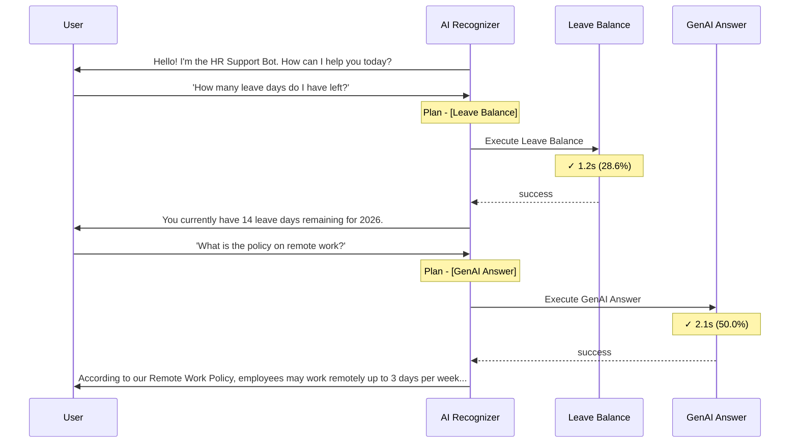
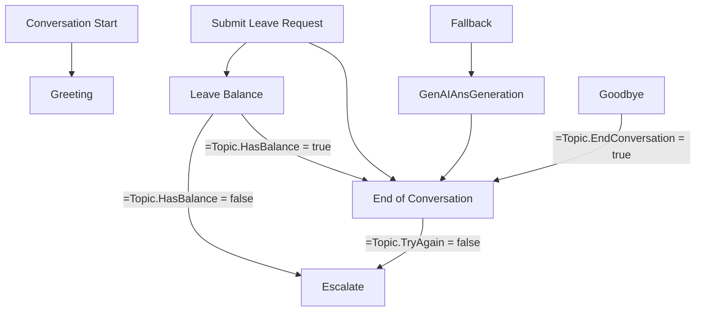

# HR_Support_Bot

## AI Configuration

| Property | Value |
| --- | --- |
| Knowledge Sources | SharePointSite, DataverseTable |
| Web Browsing | False |
| Code Interpreter | False |

### Execution Flow

### Execution Gantt

```mermaid
gantt
    dateFormat x
    axisFormat %M:%S
    title HR_Support_Bot — Execution Timeline
    section Bot
    Bot response (50ms) :e0, 1773500000000, 1773500000050
    section System
    Dialog trace (800ms) :e1, 1773500000000, 1773500000800
    section User
    User message (1.0s) :e2, 1773500000800, 1773500001800
    section Orchestrator
    Plan received (50ms) :e3, 1773500001800, 1773500001850
    Ask - 'How many leave days do I have left?' (50ms) :e4, 1773500001800, 1773500001850
    section Leave Balance
    Step - Leave Balance (1.2s) :e5, 1773500001850, 1773500003050
    section System
    Dialog trace (200ms) :e6, 1773500003050, 1773500003250
    section Bot
    Bot response (50ms) :e7, 1773500003250, 1773500003300
    section User
    User message (800ms) :e8, 1773500003300, 1773500004100
    section Orchestrator
    Plan received (50ms) :e9, 1773500004100, 1773500004150
    Ask - 'What is the policy on remote work?' (50ms) :e10, 1773500004100, 1773500004150
    section GenAI Answer
    Step - GenAI Answer (2.1s) :e11, 1773500004150, 1773500006250
    section System
    Dialog trace (150ms) :e12, 1773500006250, 1773500006400
    section Bot
    Bot response (50ms) :e13, 1773500006400, 1773500006450
```

## Bot Profile

| Property | Value |
| --- | --- |
| Schema Name | `hr_support_bot_78901` |
| Bot ID | `a1b2c3d4-e5f6-7890-abcd-ef1234567890` |
| Channels | MsTeams, DirectLine |
| Recognizer | GenerativeAIRecognizer |
| Orchestrator | Yes |
| Use Model Knowledge | True |
| File Analysis | False |
| Semantic Search | True |
| Content Moderation | High |

## Components

**12** components total — **11** active, **1** inactive

| Kind | Count | Active | Inactive |
| --- | --- | --- | --- |
| DialogComponent | 11 | 10 | 1 |
| GptComponent | 1 | 1 | 0 |

### DialogComponent (11)

| Name | Schema | State | Trigger | Dialog Kind |
| --- | --- | --- | --- | --- |
| Conversation Start | `hr_support_bot_78901.topic.ConversationStart` | Active | OnConversationStart | — |
| Greeting | `hr_support_bot_78901.topic.Greeting` | Active | OnRecognizedIntent | — |
| Leave Balance | `hr_support_bot_78901.topic.LeaveBalance` | Active | OnRecognizedIntent | — |
| Submit Leave Request | `hr_support_bot_78901.topic.SubmitLeaveRequest` | Active | OnRecognizedIntent | — |
| Fallback | `hr_support_bot_78901.topic.Fallback` | Active | OnUnknownIntent | — |
| GenAIAnsGeneration | `hr_support_bot_78901.topic.GenAIAnsGeneration` | Active | OnRedirect | — |
| Escalate | `hr_support_bot_78901.topic.Escalate` | Active | OnEscalate | — |
| On Error | `hr_support_bot_78901.topic.OnError` | Active | OnError | — |
| End of Conversation | `hr_support_bot_78901.topic.EndofConversation` | Active | OnSystemRedirect | — |
| Conversational boosting | `hr_support_bot_78901.topic.Search` | Inactive | OnUnknownIntent | — |
| Goodbye | `hr_support_bot_78901.topic.Goodbye` | Active | OnRecognizedIntent | — |

### GptComponent (1)

| Name | Schema | State | Trigger | Dialog Kind |
| --- | --- | --- | --- | --- |
| HR_Support_Bot | `hr_support_bot_78901.gpt.default` | Active | — | — |

## Topic Connection Graph

## Conversation Trace

| Property | Value |
| --- | --- |
| Bot Name | HR_Support_Bot |
| Conversation ID | `b2c3d4e5-f6a7-8901-bcde-f12345678901` |
| User Query | How many leave days do I have left? |
| Total Elapsed | 6.5s |

### Phase Breakdown

| Phase | Type | Duration | % of Total | Status |
| --- | --- | --- | --- | --- |
| Leave Balance |  | 1.2s | 28.6% | ✓ success |
| GenAI Answer |  | 2.1s | 50.0% | ✓ success |

### Event Log

| # | Position | Type | Summary |
| --- | --- | --- | --- |
| 1 | 3000 | BotMessage | Bot: Hello! I'm the HR Support Bot. How can I help you today? |
| 2 | 4000 | DialogTracing | Actions: SendActivity in Conversation Start |
| 3 | 7000 | UserMessage | User: "How many leave days do I have left?" |
| 4 | 12000 | PlanReceived | Plan: [Leave Balance] |
| 5 | 13000 | PlanReceivedDebug | Ask: "How many leave days do I have left?" |
| 6 | 14000 | StepTriggered | Step start: Leave Balance (CustomTopic) |
| 7 | 16000 | DialogTracing | Actions: BeginDialog, HttpRequestAction in Leave Balance |
| 8 | 18000 | StepFinished | Step end: Leave Balance [success] (1.2s) |
| 9 | 19000 | BotMessage | Bot: You currently have 14 leave days remaining for 2026. |
| 10 | 22000 | UserMessage | User: "What is the policy on remote work?" |
| 11 | 23000 | PlanReceived | Plan: [GenAI Answer] |
| 12 | 24000 | StepTriggered | Step start: GenAI Answer (GenAIAnsGeneration) |
| 13 | 26000 | DialogTracing | Actions: BeginDialog, SearchAndSummarize in GenAI Answer |
| 14 | 28000 | StepFinished | Step end: GenAI Answer [success] (2.1s) |
| 15 | 29000 | BotMessage | Bot: According to our Remote Work Policy, employees may work remotely up to 3 days per week... |
| 16 | 30000 | DialogTracing | Actions: SendActivity in End of Conversation |
