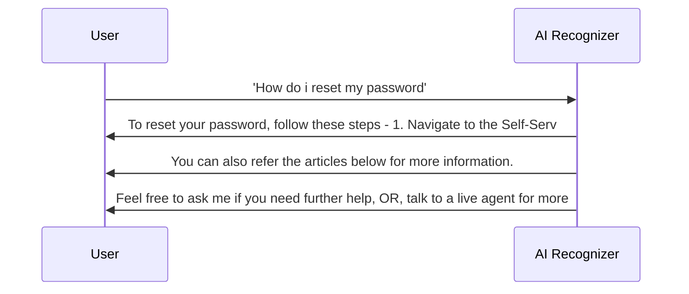

# Sample_Transcript

## Session Summary

| Property | Value |
| --- | --- |
| Start Time | 2026-02-16T11:22:21Z |
| End Time | 2026-02-16T11:22:32Z |
| Session Type | Engaged |
| Outcome | Abandoned |
| Outcome Reason | UserExit |
| Turn Count | 4 |
| Implied Success | False |

## Conversation Trace

| Property | Value |
| --- | --- |
| Bot Name |  |
| Conversation ID | `` |
| User Query | How do i reset my password |
| Total Elapsed | 11.0s |

### Execution Flow

### Execution Gantt

```mermaid
gantt
    dateFormat x
    axisFormat %M:%S
    title  — Execution Timeline
    section User
    User message (3.0s) :e0, 1771240941000, 1771240944000
    section System
    Global Global.Question = How do i reset  (50ms) :e1, 1771240944000, 1771240944050
    Redirect → topic-password-reset (7.0s) :e2, 1771240944000, 1771240951000
    Local Topic.FuncAppResp = {'answer' -'To  (50ms) :e3, 1771240951000, 1771240951050
    Local Topic.FuncAppRespJson = {'answer' - (50ms) :e4, 1771240951000, 1771240951050
    Global Global.QnAcount = 1 (1.0s) :e5, 1771240951000, 1771240952000
    Local Topic.row_id = 00000000-0000-0000-  (50ms) :e6, 1771240952000, 1771240952050
    section Bot
    Bot response (50ms) :e7, 1771240952000, 1771240952050
    Bot response (50ms) :e8, 1771240952000, 1771240952050
    Bot response (50ms) :e9, 1771240952000, 1771240952050
    section System
    Redirect → topic-end-conversation (50ms) :e10, 1771240952000, 1771240952050
    Global Global.isTimeoutReq = False (50ms) :e11, 1771240952000, 1771240952050
    Global Global.QnAcount = 2 (50ms) :e12, 1771240952000, 1771240952050
```

### Event Log

| # | Position | Type | Summary |
| --- | --- | --- | --- |
| 1 | 1000 | UserMessage | User: "How do i reset my password" |
| 2 | 3000 | VariableAssignment | Global Global.Question = How do i reset my password |
| 3 | 4000 | DialogRedirect | Redirect → topic-password-reset |
| 4 | 5000 | VariableAssignment | Local Topic.FuncAppResp = {"answer":"To reset your password, follow these steps:\n\n1. Navigate to... |
| 5 | 6000 | VariableAssignment | Local Topic.FuncAppRespJson = {"answer":"To reset your password, follow these steps:\n\n1. Navigate... |
| 6 | 7000 | VariableAssignment | Global Global.QnAcount = 1 |
| 7 | 8000 | VariableAssignment | Local Topic.row_id = 00000000-0000-0000-0000-000000000000 |
| 8 | 9000 | BotMessage | Bot: To reset your password, follow these steps:  1. Navigate to the Self-Service Password Reset... |
| 9 | 10000 | BotMessage | Bot: You can also refer the articles below for more information. |
| 10 | 11000 | BotMessage | Bot: Feel free to ask me if you need further help, OR, talk to a live agent for more assistance. |
| 11 | 12000 | DialogRedirect | Redirect → topic-end-conversation |
| 12 | 13000 | VariableAssignment | Global Global.isTimeoutReq = False |
| 13 | 14000 | VariableAssignment | Global Global.QnAcount = 2 |
